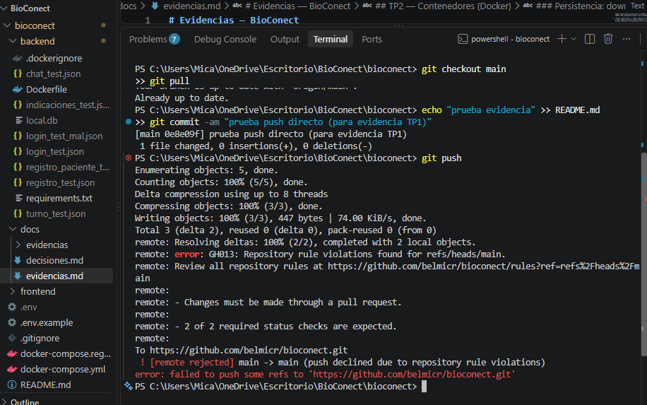
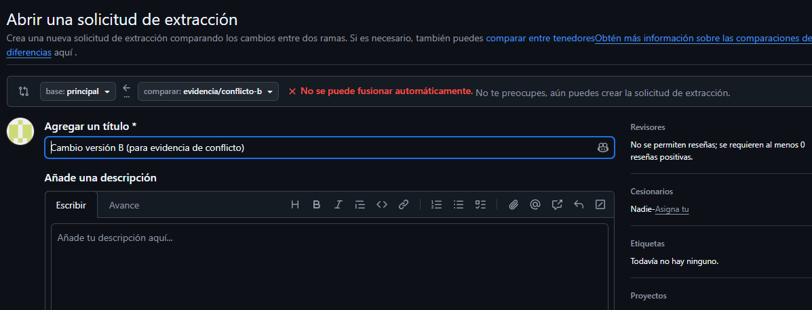
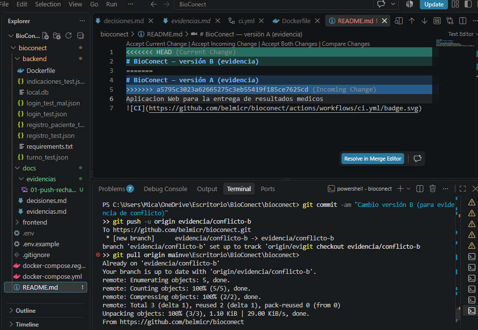
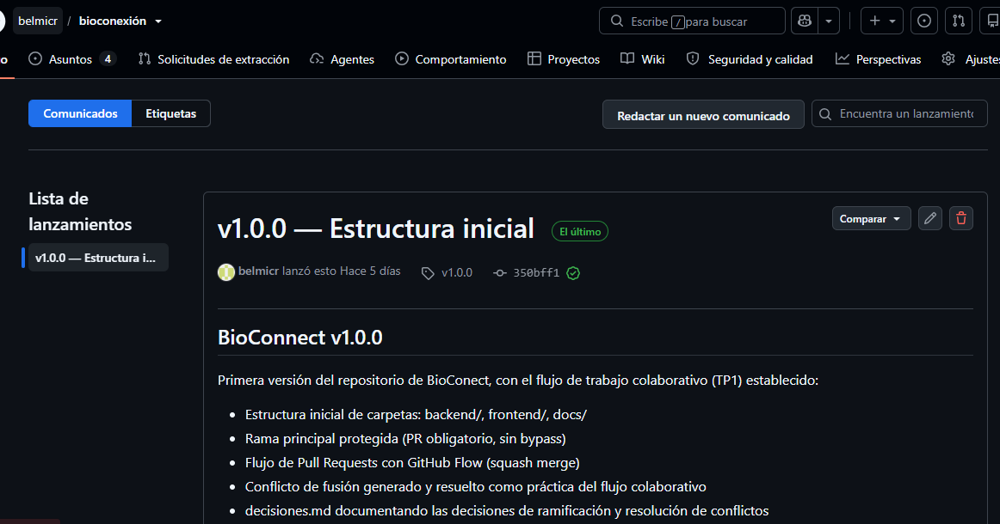

# Evidencias — BioConect

## TP1 — Git colaborativo

### 1. Push directo rechazado
Intento de push directo a main con la protección de rama activa. GitHub rechaza
el push con el error GH013 (Repository rule violations), confirmando que la
regla "Changes must be made through a pull request" está funcionando.

### 2. Aviso de conflicto de merge
Al intentar crear el Pull Request de feature/titulo-b contra main, GitHub
detecta que las ramas no se pueden fusionar automáticamente, porque ambas
modificaron la misma línea del README partiendo del mismo commit base.

### 3. Resolución del conflicto
Proceso de resolución del conflicto: git status mostrando "both modified:
README.md" tras el merge local, y la edición manual del archivo para dejar
el contenido final decidido (el archivo fue tratado como binario por Git,
por lo que no se generaron marcadores automáticos y se reescribió el
contenido a mano).

### 4. Release v1.0.0 publicada
Tag v1.0.0 creado y release publicada en GitHub, cerrando el TP1.

## TP2 — Contenedores (Docker)

### docker compose up end-to-end
Los tres servicios (db, backend, frontend) levantan correctamente con
`docker compose up -d`. El backend espera a que `db` esté `healthy` antes
de arrancar (depends_on + condition: service_healthy).

Confirmado con `docker compose ps`:
- bioconect-db-1: Up (healthy)
- bioconect-backend-1: Up
- bioconect-frontend-1: Up

http://localhost:8000/health → {"status":"ok"}
http://localhost:3000 → app React servida por nginx, con proxy /api
funcionando hacia el backend (nombre de servicio "backend" resuelto por
la red interna de compose).

### Persistencia: down/up vs down -v
1. Se creó una tabla de prueba con un dato:
   CREATE TABLE prueba_persistencia (id SERIAL PRIMARY KEY, nota TEXT);
   INSERT INTO prueba_persistencia (nota) VALUES ('dato de prueba TP2');

2. `docker compose down` + `docker compose up -d`:
   El dato sigue existiendo (SELECT devuelve la fila) → el volumen
   db_data sobrevive a la destrucción de los contenedores.

3. `docker compose down -v` + `docker compose up -d`:
   ERROR: relation "prueba_persistencia" does not exist
   El -v borró el volumen; Postgres reinicializó desde cero.

### Tamaños de imagen
- bioconect-backend:v0.1.0 → 167MB (vs python:3.12-slim base: 119MB)
- bioconect-frontend:v0.1.0 → 48.5MB (vs node:24-alpine, descartado en
  la imagen final gracias a multi-stage)

### Registry público
- https://github.com/belmicr?tab=packages
- ghcr.io/belmicr/bioconect-backend:v0.1.0 (público)
- ghcr.io/belmicr/bioconect-frontend:v0.1.0 (público)